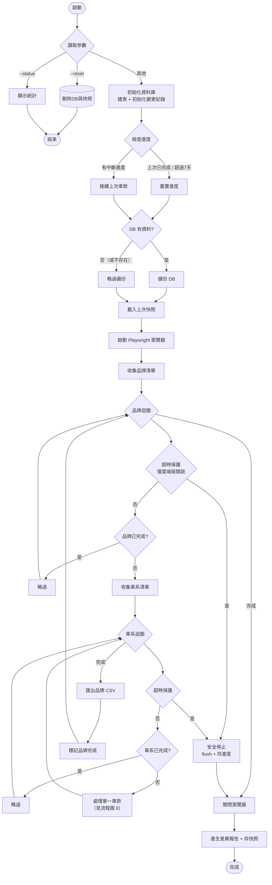
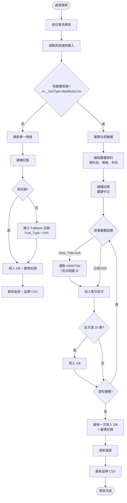
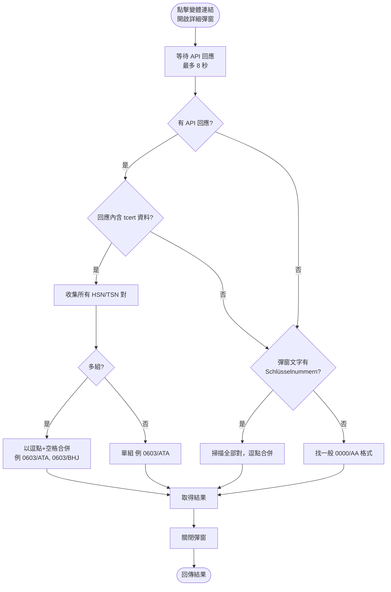
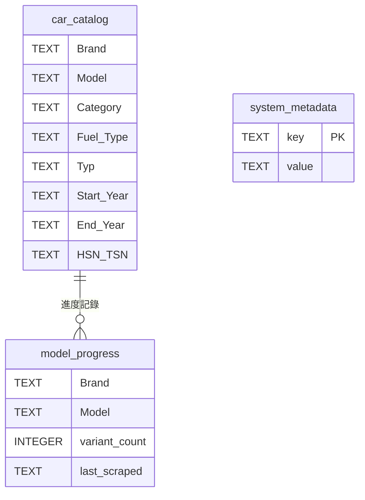

# AutoBild 爬蟲系統 使用說明書 v11.0

> 德國 AutoBild 汽車型錄爬蟲：自動擷取所有品牌、車系、車型的詳細資料（含 HSN/TSN 型式認證碼）。

---

## 目錄

- [1. 系統簡介](#1-系統簡介)
- [2. 三個版本與環境](#2-三個版本與環境)
- [3. 功能特色](#3-功能特色)
- [4. 安裝方式](#4-安裝方式)
- [5. 使用方法](#5-使用方法)
- [6. 輸出檔案說明](#6-輸出檔案說明)
- [7. 整體執行流程圖](#7-整體執行流程圖)
- [8. 單一車款處理流程圖](#8-單一車款處理流程圖)
- [9. HSN/TSN 擷取流程圖](#9-hsntsn-擷取流程圖)
- [10. 資料庫結構](#10-資料庫結構)
- [11. 變更紀錄說明](#11-變更紀錄說明)
- [12. 自動排程（GitHub Actions）](#12-自動排程github-actions)
- [13. 常見問題與故障排除](#13-常見問題與故障排除)

---

## 1. 系統簡介

本系統使用 **Playwright + Python** 模擬瀏覽器，自動瀏覽 AutoBild 汽車型錄網站：

- 掃描所有品牌（Brand）→ 車系（Model）→ 車型（Typ）
- 展開每個車系的全部變體規格
- 嘗試從 API / 網頁擷取 **HSN/TSN Schlüsselnummern**
- 自動將燃料類型、車型分類翻譯為繁體中文
- 寫入 SQLite 資料庫，匯出 CSV，產生差異報告與變更紀錄

---

## 2. 三個版本與環境

| 檔案 | 執行環境 | 5.5 小時保護 | 說明 |
|------|----------|:---:|------|
| `autobild_v11.py` | Mac / Linux 本地（VS Code） | ❌ 關閉 | 完整掃描到結束，可 Ctrl+C 安全中斷 |
| `autobild_win.py` | Windows 本地 | ❌ 關閉 | 同上，Windows 專用 |
| `autobild_github.py` | GitHub Actions（雲端） | ✅ 開啟 | 避免雲端工作超時被平台砍掉 |

> **版本同步**：三個檔案共用相同邏輯。修改任一版時，其餘兩版需同步更新。

---

## 3. 功能特色

- ✅ 自動爬取所有品牌與車系
- ✅ 自動展開所有變體規格
- ✅ HSN/TSN 擷取（API 優先，DOM 備援；多組以 `, ` 逗點隔開）
- ✅ 7 天週期檢查：超過 7 天自動重掃、未完成自動接續
- ✅ 中斷續跑：偵測到未完成進度自動從上次車款繼續
- ✅ 每完成一個車款 → 立即寫入 DB + 登記變更紀錄 + 更新品牌 CSV
- ✅ 中文翻譯（車型分類、燃料類型）
- ✅ DB 自動備份（DB 為空時略過）
- ✅ 快照 / 差異報告（新增、修改、刪除）
- ✅ 變更紀錄 Excel（INSERT 綠底 / UPDATE 紅底）
- ✅ CSV 匯出（每品牌一個檔案）

---

## 4. 安裝方式

### 4.1 環境需求

- Python 3.10 以上
- 瀏覽器：Playwright 會自動安裝 Chromium

### 4.2 安裝步驟

```bash
# 1. 安裝 Python 套件
pip install -r requirements.txt

# 2. 安裝 Playwright 瀏覽器
playwright install chromium

# Mac/Linux 若需系統相依套件
playwright install-deps
```

`requirements.txt` 內容：

```
nest_asyncio>=1.5.8
playwright>=1.40.0
pandas>=2.0.0
```

---

## 5. 使用方法

### 5.1 完整掃描

```bash
python autobild_v11.py
```

> Windows 版：`python autobild_win.py`；雲端版由 GitHub Actions 排程，不需手動執行。

### 5.2 參數說明

| 參數 | 說明 | 範例 |
|------|------|------|
| `--brand <品牌>` | 只掃描指定品牌（大寫） | `python autobild_v11.py --brand VW` |
| `--test` | 測試模式（每品牌只取前 2 個車系、每車系前 6 筆） | `python autobild_v11.py --test` |
| `--status` | 顯示目前資料庫統計，不執行爬蟲 | `python autobild_v11.py --status` |
| `--reset` | 重置資料庫與快照後退出 | `python autobild_v11.py --reset` |
| `--no-diff` | 跳過差異報告 | `python autobild_v11.py --no-diff` |

### 5.3 安全中斷

執行中按 **Ctrl+C**（或關閉視窗）：

1. 系統偵測中斷訊號
2. 立即 `flush()` 寫入已抓到的資料
3. 更新進度記錄
4. 下次啟動自動從中斷處繼續

> 因為「每車款完成即寫入 + 更新 CSV」，中斷最多只會損失**目前正在處理的那一個車款**。

---

## 6. 輸出檔案說明

| 檔案 | 說明 |
|------|------|
| `autobild_master.db` | SQLite 主資料庫（全部資料） |
| `autobild_master_backup.db` | 每次執行前自動備份（DB 有資料時） |
| `AutoBild_Exports/<品牌>.csv` | 每品牌一個 CSV 匯出檔 |
| `AutoBild_Exports/autobild_changelog.xlsx` | 變更紀錄（INSERT/UPDATE） |
| `AutoBild_Exports/autobild_snapshot.xlsx` | 資料快照（供下次差異比對） |
| `AutoBild_Exports/autobild_diff.xlsx` | 差異報告（新增/修改/刪除，每天一個分頁） |

### 6.1 CSV 欄位

| 欄位 | 說明 |
|------|------|
| Brand | 品牌 |
| Model | 車系 |
| Category | 車型分類（繁體中文，例：轎車、休旅車、雙門跑車） |
| Fuel_Type | 燃料類型（繁體中文，例：汽油、柴油、電力、插電式油電混合） |
| Typ | 規格名稱 |
| Start_Year | 開始年份 |
| End_Year | 結束年份（仍販售為「至今」） |
| HSN_TSN | 型式認證碼；多組時以逗點+空格隔開（例：`0603/ATA, 0603/BHJ`） |

---

## 7. 整體執行流程圖



---

## 8. 單一車款處理流程圖



---

## 9. HSN/TSN 擷取流程圖

> HSN/TSN Schlüsselnummern 是德國的型式認證碼（如 `0603/ATA`）。若一個車款對應多組，會以 `, ` 逗點+空格寫在一起（如 `0603/ATA, 0603/BHJ`）。



---

## 10. 資料庫結構



### 10.1 進度與週期邏輯

| 情境 | 系統行為 |
|------|----------|
| 上次標記為 `completed` | 重置進度，從頭掃描 |
| 距離上次執行超過 7 天 | 重置進度，從頭掃描 |
| 偵測到未完成進度（<7 天） | 自動接續上次中斷的車款 |
| 單一車款已抓過相同筆數 | 直接略過 |

---

## 11. 變更紀錄說明

檔案：`AutoBild_Exports/autobild_changelog.xlsx`（分頁 `Changelog`）

| 欄位 | 說明 |
|------|------|
| Timestamp | 寫入時間 |
| Action | `INSERT`（新增，綠底）／ `UPDATE`（修改，紅底） |
| Brand / Model / Category / Fuel_Type / Typ | 車款資料 |
| Start_Year / End_Year | 年份 |
| HSN_TSN_Old | 修改前的 HSN/TSN（新增為空） |
| HSN_TSN_New | 新的 HSN/TSN |

**時機**：每完成一個車款（或批次滿 20 筆）即寫入變更紀錄，不會等全部跑完才登記。

> 已知設計：若重新掃描同一車款且資料完全相同（無 INSERT/UPDATE），不會重複登記。

---

## 12. 自動排程（GitHub Actions）

設定檔：`.github/workflows/autobild.yml`

| 觸發方式 | 說明 |
|----------|------|
| `push` 到 main | 自動執行 |
| 手動（workflow_dispatch） | 可在 Actions 頁面選擇指定品牌、強制全面掃描 |

執行流程：
1. 下載上次執行上傳的資料庫（`autobild-db-latest` artifact）
2. 安裝依賴 + Chromium
3. 執行 `autobild_github.py`（5.5 小時超時保護）
4. 上傳 CSV、最新 DB、帶編號 DB 歷史檔、進度檔

> **注意**：雲端版保留 5.5 小時保護，避免超過 GitHub Actions 的執行上限。

---

## 13. 常見問題與故障排除

### 13.1 想重抓所有資料？
```bash
python autobild_v11.py --reset
python autobild_v11.py
```
`--reset` 會刪除 DB、快照、差異檔，從零開始。

### 13.2 只想重抓某個品牌 / 車系？
刪除 `model_progress` 中對應的記錄，或直接對該品牌使用 `--brand`：
```bash
python autobild_v11.py --brand VW
```
品牌若已被標記完成，會略過；需先重置：
```bash
python autobild_v11.py --reset
python autobild_v11.py --brand VW
```

### 13.3 某些車款 Fuel_Type 是 N/A？
這些車款頁面沒有標準變體表格（用其他版面呈現），系統只能建立 Fallback 記錄，因此燃料類型為 N/A、也無法擷取 HSN/TSN。屬正常限制。

### 13.4 HSN_TSN 全是 N/A？
- 確認網站彈窗能正常開啟（網路或反爬蟲攔截）
- 檢查 API 回應是否含 `tcert`（執行時 `[API] tcert FOUND in:` 訊息）
- 老車 / 新創品牌可能根本沒有註冊 HSN/TSN（如 XPENG、WIESMANN）

### 13.5 執行後沒看到備份檔？
DB 為空（0 筆）時系統會略過備份，屬正常設計。

### 13.6 如何確認目前進度？
```bash
python autobild_v11.py --status
```

### 13.7 中斷後重啟，卻從頭開始？
表示上次執行已標記為 `completed` 或距上次執行超過 7 天，系統依設計重新掃描。

---

*說明書對應程式版本：v11.0（autobild_v11.py / autobild_win.py / autobild_github.py）*
