# 🚗 RDKS 胎壓感測器自動爬蟲系統 (每週自動更新本機版)

這是一個專為抓取、彙整汽車胎壓感測器（TPMS）資料所設計的全自動化爬蟲系統。此版本專為 **本機環境 (如 VS Code) 手動執行** 所打造，具備強大的環境適應力與中斷保護。

## ✨ 核心特色

1. **極致 SQL View 壓縮**：
   * 透過 SQL 原生的 `GROUP_CONCAT` 視圖，確保 **品牌、車系、型號** 相同的車款只會佔據一行 Excel。
   * 不同的感測器 (OE sensor)、頻率、HSN/TSN 會自動使用 `,` 逗號整齊串接，版面極度乾淨！
2. **深度 API 解析**：
   * 內建雙重 API 抓取。遇到隱藏的日期或頻率時，會自動解析 `gpsr/data` 接口補齊。
3. **無縫斷點接關與優雅中斷 (Graceful Shutdown)**：
   * 隨時可以在 VS Code 按下暫停 (Ctrl+C 或停止鍵)。程式會攔截中斷訊號，將暫存區的殘留資料安全寫入資料庫並匯出備份，達成「零資料遺失」。
   * 下次啟動時，精準從中斷的「車系型號」接續努力，完美銜接零浪費。
4. **七天自動大掃除**：
   * 內建七天週期檢查。只要距離上次完整抓取超過 7 天，按下啟動鍵時系統會自動失去記憶，進入「全面掃描模式」更新所有最新年份資料。（註：需使用者定期手動執行程式觸發此機制）。
5. **智能環境適應 (突破 PEP 668/uv 限制)**：
   * 執行時會自動檢查並安裝缺少的套件 (如 `requests`, `pandas`)。
   * 具備「三重突破機制」，即使在受保護的 Python 環境 (如 `uv` 管理的環境) 也能強制且安全地完成安裝，實現真正的一鍵啟動。

## 📁 檔案產出說明

執行完畢後，所有最新資料會自動儲存於 `胎壓資料庫_每週更新版/` 資料夾內，並依據汽車品牌分類為獨立的 Excel 報表。

| 檔案 | 說明 |
|------|------|
| `{Brand}_Data.xlsx` | 各品牌最新資料（即時更新） |
| `變更紀錄.xlsx` | 變更報表（新增🟢 / 修改🔴🟢 / 每日分頁） |
| `胎壓檢測器資料庫_V10.db` | SQLite 主資料庫 |
| `胎壓檢測器資料庫_V10_備份.db` | DB 備份（每次執行覆蓋） |
| `胎壓檢測器資料庫_V10.sql` | SQL dump 備份 |
| `scrape_progress_V10.json` | 斷點進度檔 |

---

## 詳細完整流程圖

# 🚗 RDKS 爬蟲系統核心架構圖 (Pro 專業版)

本版本致敬高階系統架構圖風格，採用暗色模組劃分、全彩狀態標示，並完整收錄 7 天週期、API 雙軌抓取與優雅中斷防護的所有底層邏輯。

```mermaid
flowchart LR

    %% ==========================================
    %% 視覺樣式定義 (致敬參考圖配色)
    %% ==========================================
    classDef startEnd fill:#fff,stroke:#333,stroke-width:2px,color:#000,font-weight:bold;
    classDef diamond fill:#fff,stroke:#555,stroke-width:2px,color:#000,font-weight:bold;
    classDef greenBox fill:#e8f5e9,stroke:#2e7d32,stroke-width:2px,color:#1b5e20,font-weight:bold;
    classDef redBox fill:#ffebee,stroke:#c62828,stroke-width:2px,color:#b71c1c,font-weight:bold;
    classDef actionBox fill:#e3f2fd,stroke:#1565c0,stroke-width:2px,color:#0d47a1,font-weight:bold;
    classDef dbBox fill:#fff3e0,stroke:#e65100,stroke-width:2px,color:#e65100,font-weight:bold;
    classDef warningBox fill:#fff8e1,stroke:#fbc02d,stroke-width:2px,color:#f57f17,font-weight:bold;

    %% ==========================================
    %% ① 啟動前進度檢查
    %% ==========================================
    subgraph SG1 ["① 啟動前進度檢查"]
        direction TB
        S1([系統啟動]) --> S2["自動檢查/安裝缺失套件\n(三重突破機制)"]
        S2 --> S3{"讀取\nscrape_progress.json"}
        S3 --> S4{"距離上次掃描\n< 7 天?"}
        
        S4 -- 否 (>7天) --> S5["全新週期\n清空舊斷點紀錄\n開始全面掃描"]
        S4 -- 是 (<7天) --> S6["接續執行\n載入中斷之品牌\n(last_brand)"]
    end
    style SG1 fill:#2d2d2d,stroke:#555,color:#fff

    %% ==========================================
    %% ② 資料庫與導航
    %% ==========================================
    subgraph SG2 ["② 資料庫與爬蟲導航"]
        direction TB
        D1[("建立 SQLite 與表單\n建立 SQL View 視圖")]
        D2{"遍歷 品牌 (Brand)\n是否需略過?"}
        D3["跳過此品牌\n(確保 Excel 存在)"]
        D4["儲存進度 (JSON)"]
        D5["遍歷車系 (Model)\n遍歷型號 (Typ)\n遍歷年份 (Year)"]

        D1 --> D2
        D2 -- 是 (未達斷點) --> D3 --> D2
        D2 -- 否 (進入斷點) --> D4 --> D5
    end
    style SG2 fill:#2d2d2d,stroke:#555,color:#fff

    %% ==========================================
    %% ③ 靜態 API 攔截與解析
    %% ==========================================
    subgraph SG3 ["③ 靜態 API 攔截與解析"]
        direction TB
        A1["呼叫 API 1: 取得基礎資料\n(HSN / TSN)"]
        A2{"包含 OE 原廠\n感測器?"}
        A3["寫入空值保留車型"]
        A4["呼叫 API 2: 批次取得\n感測器深度詳細資訊\n(gpsr/data)"]
        A5["解析字串與防呆提取:\n廠商 / 頻率 / 日期 / OE Nummer"]
        A6["加入暫存佇列\nbatch_data"]

        A1 --> A2
        A2 -- 無 --> A3 --> A6
        A2 -- 有 --> A4 --> A5 --> A6
    end
    style SG3 fill:#2d2d2d,stroke:#555,color:#fff

    %% ==========================================
    %% ④ 資料寫入與聚合
    %% ==========================================
    subgraph SG4 ["④ 資料寫入與聚合"]
        direction TB
        W1{"暫存佇列\n> 80 筆?"}
        W2[("寫入 SQLite 資料庫\n(REPLACE INTO 去重)")]
        W3["清空暫存區"]

        W1 -- 是 --> W2 --> W3
    end
    style SG4 fill:#2d2d2d,stroke:#555,color:#fff

    %% ==========================================
    %% ⑤ 防護與錯誤恢復
    %% ==========================================
    subgraph SG5 ["⑤ 防護與錯誤恢復"]
        direction TB
        E1{"攔截 Ctrl+C 或中斷訊號\n(signal_handler)"}
        E2["觸發 graceful_stop = True"]
        E3[("強制寫入殘留暫存\n保護當前斷點\n補產缺失 Excel")]

        E1 -- 觸發 --> E2 --> E3
    end
    style SG5 fill:#2d2d2d,stroke:#555,color:#fff

    %% ==========================================
    %% ⑥ 匯出與收尾管理
    %% ==========================================
    subgraph SG6 ["⑥ 匯出與收尾管理"]
        direction TB
        F1["每個車系 (Model) 完成\n即時更新 Excel + 變更紀錄"]
        F2["透過 SQL View 查詢\n(GROUP_CONCAT 壓縮重複列)"]
        F3["匯出 Brand_Data.xlsx"]
        F4{"所有品牌完成?"}
        F5["標記任務完成\n清除斷點"]
        F6[("匯出 .sql 備份檔")]
        F7([程式安全退出])

        F1 --> F2 --> F3 --> F4
        F4 -- 是 --> F5 --> F6 --> F7
    end
    style SG6 fill:#2d2d2d,stroke:#555,color:#fff

    %% ==========================================
    %% 模組間核心連線 (跨區塊動線)
    %% ==========================================
    
    %% 啟動 -> 導航
    S5 --> D1
    S6 --> D1
    
    %% 導航 -> API
    D5 ==>|執行迴圈| E1
    E1 -- 否 (平穩運行) --> A1
    
    %% API -> 寫入
    A6 ==> W1
    
    %% 寫入 -> 導航 (迴圈返回)
    W1 -- 否 --> D5
    W3 --> D5
    
    %% 導航 -> 匯出
    D5 -. 該車系結束 .-> F1
    F4 -- 否 (回到下一品牌) --> D2

    %% 中斷 -> 備份退出
    E3 ===> F6


    %% ==========================================
    %% 統一套用顏色類別 (GitHub 100% 相容寫法)
    %% ==========================================
    class S1,F7 startEnd;
    class S3,S4,D2,A2,W1,F4 diamond;
    class S6,A5,F3,F5 greenBox;
    class S5,E1 redBox;
    class S2,D4,D5,A1,A4,A6,F1,F2 actionBox;
    class D1,W2,E3,F6 dbBox;
    class A3,E2 warningBox;
```



---

【簡化版流程圖 / 技術架構展示】

🚗 RDKS 爬蟲系統核心架構圖 (簡報專用版)

此版本去除了繁瑣的迴圈返回線條，將系統抽象為四大平行階段，呈現完美的 1x4 橫向佈局，最適合用於簡報提案。同時套用了專業的深色背景與高對比色彩。


---

## 🗂️ 目錄結構

```
胎壓資料庫_每週更新版/          ← 輸出資料夾 (自動建立)
├── AIWAYS_Data.xlsx              ← 各品牌資料 (每車系即時更新)
├── ALFA ROMEO_Data.xlsx
├── AUDI_Data.xlsx
├── ...
└── 變更紀錄.xlsx                  ← 變更報表 (每日分頁)

程式根目錄:
├── V10.py                        ← 主程式 (一鍵啟動)
├── 胎壓檢測器資料庫_V10.db       ← SQLite 資料庫
├── 胎壓檢測器資料庫_V10_備份.db  ← DB 備份 (每次執行覆蓋)
├── 胎壓檢測器資料庫_V10.sql      ← SQL dump 備份
└── scrape_progress_V10.json      ← 進度紀錄 (斷點續傳用)
```

---

## 📄 輸出檔案說明

### 1. 各品牌 Excel (`{Brand}_Data.xlsx`)

| 欄位 | 說明 |
|------|------|
| Brand | 品牌名稱 |
| Model | 型號分類 |
| Typ | 版本名稱 |
| 年份 | 生產年份區間 |
| HSN | 德國 HSN 碼 |
| TSN | 德國 TSN 碼 |
| created date | 感測器年份/批號 |
| OE sensor | OE 感測器編號 |
| OE Nummer | OE 零件號碼 |
| Manufacturer | 感測器製造商 |
| Frequency | 頻率 (433/434/315 MHz) |

> 相同 **品牌/車系/型號/年份** 只佔一行，多個感測器以 `,` 逗號串接。

### 2. 變更紀錄 (`變更紀錄.xlsx`)

- 每日一個分頁（格式 `YYYYMMDD`）
- 同一天中斷重啟 → 合併到同一頁
- 不同天 → 開新分頁

**顏色標記：**
- 🟢 **新增 (New)** → 整行綠底綠字
- 🟢🟡 **修改 (Updated)** → 舊值 (O) 紅底紅字、新值 (N) 綠底綠字
- ⚪ 無變更 → 顯示「本日無任何變更」

---

## 🛡️ 中斷保護機制

| 情境 | 保護措施 |
|------|---------|
| **Ctrl+C / 停止鍵** | `signal_handler` 攔截 → `graceful_stop=True` → 安全寫入殘留資料、保留斷點、補產 Excel |
| **正常結束** | 寫入所有資料、Excel、變更紀錄、SQL 備份 |
| **程式崩潰** | `finally` 區塊補產缺漏的 Excel + 寫入變更紀錄 |
| **強制終止 (SIGKILL)** | DB 資料已即時寫入 (每 80 筆 / 每個車系)；下次啟動 `recover_missing_excels()` 自動補產 |
| **超過 7 天重跑** | 自動進入「全面掃描模式」，更新所有最新年份資料 |
| **中斷重啟 (同日)** | 變更紀錄合併到同一日分頁 |
| **中斷重啟 (隔日)** | 變更紀錄開新分頁 |

### 寫入時機（確保即時性 / 零資料遺失）

| 資料 | 寫入時機 |
|------|---------|
| **DB (SQLite)** | • 暫存累積 80 筆<br>• 每個車系 (Model) 完成<br>• 中斷時 (Graceful Shutdown)<br>• 程式結束 `finally` |
| **Brand Excel** | • 每個車系完成 (即時更新)<br>• 啟動時 `recover_missing_excels()`<br>• 結束時 `finally` 補產 |
| **變更紀錄** | • 每個車系完成 (即時更新)<br>• 結束時 `finally` 最終寫入 |
| **進度檔 JSON** | • 每個 Brand 開始<br>• 每個 Type-Group |

---

## ⚠️ 異常處理

- **缺少套件** → 啟動時自動偵測並安裝（三重突破：`pip` → `--user` → `--break-system-packages`）
- **API 請求失敗** → 自動重試 5 次 (backoff)，429 等待 10 秒
- **DB 寫入失敗** → `save_batch_to_sql` 內含 try-except，不影響程式繼續
- **Excel 寫入失敗** → `_write_brand_diff` 內含 try-except
- **無資料** → 感測器資料為空的 version 仍會寫入一筆空值佔位
- **中斷補產異常** → 印出警告，不影響主流程

---

## 🚀 執行方式

```bash
# 一鍵執行 (前景) — 自動安裝缺失套件
python3 V10.py

# 背景執行 (推薦，爬蟲耗時數小時)
nohup python3 -u V10.py > run.log 2>&1 &

# 查看進度
tail -f run.log

# 優雅中斷 (Ctrl+C)
# → 自動安全寫入殘留資料並儲存斷點，下次從原處續跑
```
