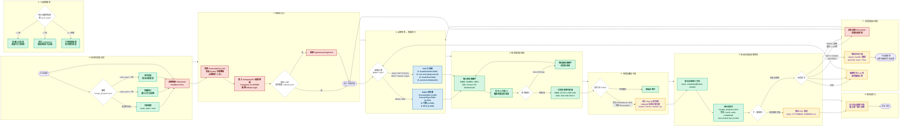

```mermaid
flowchart LR
    %% Partslink24 TPMS 爬蟲流程圖 v4 — 支援記憶體/斷點續爬
    classDef phase_init fill:#FADBD8,stroke:#C0392B,stroke-width:2px,color:#641E16,font-weight:bold
    classDef phase_nav fill:#D6EAF8,stroke:#2980B9,stroke-width:2px,color:#154360,font-weight:bold
    classDef phase_parse fill:#D5F5E3,stroke:#27AE60,stroke-width:2px,color:#145A32,font-weight:bold
    classDef phase_save fill:#FCF3CF,stroke:#F39C12,stroke-width:2px,color:#7D3C98,font-weight:bold
    classDef phase_verify fill:#E8DAEF,stroke:#8E44AD,stroke-width:2px,color:#4A235A,font-weight:bold
    classDef decision fill:#FFFFFF,stroke:#7F8C8D,stroke-width:2px,stroke-dasharray:5 5
    classDef phase_memory fill:#D5F5E3,stroke:#1ABC9C,stroke-width:2px,color:#145A32,font-weight:bold

    subgraph Phase0 ["⑩ 啟動前進度檢查"]
        direction TB
        START([系統啟動]) --> PROG{"讀取<br>scrape_progress.json"}:::decision
        PROG -- "檔案不存在" --> FRESH["全新週期<br>cycle_start = now"]:::phase_memory
        PROG -- "cycle_start < 7天" --> RESUME["接續執行<br>載入已完成清單"]:::phase_memory
        PROG -- "cycle_start > 7天" --> RESET["清空進度<br>開始全新週期"]:::phase_memory
        FRESH --> LAUNCH
        RESUME --> LAUNCH
        RESET --> LAUNCH
    end

    subgraph Phase1 ["① 啟動與登入"]
        direction TB
        LAUNCH["啟動無頭 Chromium<br>headless=True"]:::phase_init
        LAUNCH --> UC["移除 #usercentrics-root<br>突破 Cookie 同意彈窗<br>(反覆執行 3 次)"]:::phase_init
        UC --> LOGIN["填入 Company ID / 帳號密碼<br>Company: de-416440<br>點擊 hidden-login"]:::phase_init
        LOGIN --> WAIT{"等待 15 秒<br>是否需要 Squeezeout?"}:::decision
        WAIT -- "是" --> SQUEEZE["點擊 squeezeout-login-btn"]:::phase_init
        WAIT -- "否" --> READY([進入目錄頁面])
        SQUEEZE --> READY
    end

    subgraph Phase2 ["② 品牌導覽 — 雙軌模式"]
        direction TB
        READY --> BRAND{"選擇品牌<br>BMW? VAG?"}:::decision
        BRAND -- "BMW / MINI" --> BMW_NAV["BMW 式導覽<br>① modelTable (x≈60)<br>② modelTypeTable (x≈334)<br>③ 引擎 (x>500)<br>④ ECE (x>600)"]:::phase_nav
        BRAND -- "Audi / VW / Porsche<br>SEAT / Skoda / Cupra" --> VAG_NAV["VAG 式導覽<br>① modelFamiliesTable<br>② row click [data-test-id]<br>③ modelYearTable<br>④ restrictionTable1/2/3"]:::phase_nav
    end

    subgraph Phase3 ["③ 智慧搜尋與解析"]
        direction TB
        BMW_NAV --> SEARCH["輸入搜尋關鍵字<br>BMW: 433MHz / RDC<br>VAG: Sensor für Reifendruck"]:::phase_parse
        VAG_NAV --> SEARCH
        SEARCH --> LOAD["等待 12 秒載入<br>攔截動態渲染結果"]:::phase_parse
        LOAD --> RESULT{"搜尋結果?"}:::decision
        RESULT -- "keine Einträge" --> NO_RESULT["嘗試備選關鍵字<br>或切換車款"]:::phase_parse
        RESULT -- "有結果" --> EXTRACT["正則提取零件號碼<br>BMW: XX XX X XXX XXX<br>VAG: XXX XXX XXX X"]:::phase_parse
        NO_RESULT --> SEARCH
    end

    subgraph Phase4 ["④ 智慧過濾與去重"]
        direction TB
        EXTRACT --> FILTER{"是否為 TPMS?"}:::decision
        FILTER -- "包含 Reifendruck / RDC<br>排除 Steuergerät" --> SAVE_DB["寫入 SQLite 資料庫<br>UNIQUE 約束自動去重<br>brand / series / model / pn"]:::phase_save
        FILTER -- "不符條件" --> SKIP["跳過此零件"]:::phase_parse
    end

    subgraph Phase5 ["⑤ 斷點記憶與週期管理"]
        direction TB
        SAVE_DB --> MARK["標記此車款已完成<br>mark_completed(brand, model)"]:::phase_memory
        MARK --> SAVE_JSON["儲存進度至<br>scrape_progress.json<br>包含: cycle_start, completed,<br>last_brand, last_model"]:::phase_memory
        SAVE_JSON --> NEXT{"下一個車款?"}:::decision
        NEXT -- "有更多車款" --> CHECK_DONE
        NEXT -- "所有車款完成" --> EXPORT
    end

    subgraph Phase6 ["⑥ 匯出與統計"]
        direction TB
        EXPORT["匯出 CSV 報表<br>tpms_YYYYMMDD_HHMMSS.csv"]:::phase_save
        EXPORT --> STATS["統計各品牌零件數<br>顯示唯一零件清單"]:::phase_save
        STATS --> DONE([安全退出])
    end

    subgraph Phase4b ["⑦ 防護與錯誤恢復"]
        direction TB
        CHECK_DONE{"檢查異常"}:::decision
        CHECK_DONE -- "EPIPE / 超時<br>運行 > 4小時" --> RESTART["重新啟動 Chromium<br>記錄失敗車款"]:::phase_init
        CHECK_DONE -- "Ctrl+C / SIGINT<br>SIGTERM" --> EMERGENCY["緊急安全存檔<br>signal_handler 觸發<br>graceful_stop = True"]:::phase_save
        CHECK_DONE -- "正常" --> WAIT_RAND["隨機等待 5-10 秒<br>避免觸發反爬"]:::phase_save
        RESTART --> READY
        EMERGENCY --> NEXT_START([下次啟動時<br>自動接續未完成品牌])
    end

    subgraph Phase8 ["⑧ 7天週期循環"]
        direction TB
        CYCLE{"每次啟動時檢查<br>距 cycle_start?"}:::decision
        CYCLE -- "< 7天" --> RESUME2["接續上次進度<br>跳過已完成車款"]:::phase_memory
        CYCLE -- "> 7天" --> RESET2["清空 completed<br>重新爬取所有品牌"]:::phase_memory
        CYCLE -- "== 7天整" --> FULL["完整重新驗證<br>確保資料最新"]:::phase_memory
    end

    %% 主流程連線
    START --> LAUNCH
    CHECK_DONE --> WAIT_RAND
    WAIT_RAND --> BRAND

    %% 跨區塊連線
    Phase0 --> Phase1
    Phase1 --> Phase2
    Phase2 --> Phase3
    Phase3 --> Phase4
    Phase4 --> Phase5
    Phase5 --> Phase4b
    Phase5 --> Phase6
    Phase4b --> Phase2
```
