# Partslink24 TPMS 爬蟲技術報告 v5.0

> **爬蟲版本**：v5.0（新 DB 格式 + 記憶體/斷點續爬）
> **報告日期**：2026 年 7 月 24 日
> **Partslink24 存取帳號**：de-416440

---

## 一、專案概況

### 目標
從 Partslink24（歐洲汽車零件目錄系統）自動化爬取 **BMW 集團**（BMW、MINI）與 **VAG 集團**（Audi、VW、Porsche、SEAT、Skoda、Cupra）的 TPMS（胎壓監測系統）感測器零件號碼，以及 Mercedes、Toyota、Volvo 的嘗試性爬取。

### 涵蓋範圍

| 集團 | 品牌 | 車款數量 | 搜尋關鍵字 | 導覽模式 |
|------|------|----------|-----------|---------|
| BMW | BMW | 11 個車系 | `433MHz` | BMW式 |
| BMW | MINI | 4 個車系 | `433MHz` | BMW式 |
| Audi | Audi | 9 個車款 | `Sensor für Reifendruck` | VAG式 |
| VW | Volkswagen | 8 個車款 | `Sensor für Reifendruck` | VAG式 |
| VW | Porsche | 4 個車款 | `Sensor für Reifendruck` | VAG式 |
| VW | SEAT | 5 個車款 | `Sensor für Reifendruck` | VAG式 |
| VW | Skoda | 6 個車款 | `Sensor für Reifendruck` | VAG式 |
| VW | Cupra | 4 個車款 | `Sensor für Reifendruck` | VAG式 |
| Mercedes | Mercedes | 8 個底盘 | `Reifendrucksensor` | Mercedes式 |
| Toyota | Toyota | 9 個車款 | `TPMS` | Toyota式 |
| Volvo | Volvo | 12 個車款 | `TPMS` | VAG式 |

### 技術棧
- **語言**：Python 3.12
- **瀏覽器自動化**：Playwright（headless Chromium）
- **資料儲存**：SQLite + CSV 匯出
- **平台**：macOS（Darwin）

---

## 二、完整流程圖（Mermaid）

```mermaid
flowchart LR
    %% Partslink24 TPMS 爬蟲流程圖 v4 — 完整版
    classDef phase_init fill:#FADBD8,stroke:#C0392B,stroke-width:2px,color:#641E16,font-weight:bold
    classDef phase_nav fill:#D6EAF8,stroke:#2980B9,stroke-width:2px,color:#154360,font-weight:bold
    classDef phase_parse fill:#D5F5E3,stroke:#27AE60,stroke-width:2px,color:#145A32,font-weight:bold
    classDef phase_save fill:#FCF3CF,stroke:#F39C12,stroke-width:2px,color:#7D3C98,font-weight:bold
    classDef phase_verify fill:#E8DAEF,stroke:#8E44AD,stroke-width:2px,color:#4A235A,font-weight:bold
    classDef decision fill:#FFFFFF,stroke:#7F8C8D,stroke-width:2px,stroke-dasharray:5 5
    classDef phase_memory fill:#D5F5E3,stroke:#1ABC9C,stroke-width:2px,color:#145A32,font-weight:bold

    subgraph Phase0 ["① 啟動前進度檢查"]
        direction TB
        START([系統啟動]) --> PROG{"讀取<br>scrape_progress.json"}:::decision
        PROG -- "檔案不存在" --> FRESH["全新週期<br>cycle_start = now"]:::phase_memory
        PROG -- "cycle_start < 7天" --> RESUME["接續執行<br>載入已完成清單"]:::phase_memory
        PROG -- "cycle_start > 7天" --> RESET["清空進度<br>開始全新週期"]:::phase_memory
        FRESH --> LAUNCH
        RESUME --> LAUNCH
        RESET --> LAUNCH
    end

    subgraph Phase1 ["② 啟動與登入"]
        direction TB
        LAUNCH["啟動無頭 Chromium<br>headless=True"]:::phase_init
        LAUNCH --> UC["移除 #usercentrics-root<br>突破 Cookie 同意彈窗<br>(反覆執行 3 次)"]:::phase_init
        UC --> LOGIN["填入 Company ID / 帳號密碼<br>Company: de-416440<br>點擊 hidden-login"]:::phase_init
        LOGIN --> WAIT{"等待 15 秒<br>是否需要 Squeezeout?"}:::decision
        WAIT -- "是" --> SQUEEZE["點擊 squeezeout-login-btn"]:::phase_init
        WAIT -- "否" --> READY([進入目錄頁面])
        SQUEEZE --> READY
    end

    subgraph Phase2 ["③ 品牌導覽 — 雙軌模式"]
        direction TB
        READY --> BRAND{"選擇品牌<br>BMW? VAG?"}:::decision
        BRAND -- "BMW / MINI" --> BMW_NAV["BMW 式導覽<br>① modelTable (x≈60)<br>② modelTypeTable (x≈334)<br>③ 引擎 (x>500)<br>④ ECE (x>600)"]:::phase_nav
        BRAND -- "Audi / VW / Porsche<br>SEAT / Skoda / Cupra" --> VAG_NAV["VAG 式導覽<br>① modelFamiliesTable<br>② row click [data-test-id]<br>③ modelYearTable<br>④ restrictionTable1/2/3"]:::phase_nav
    end

    subgraph Phase3 ["④ 智慧搜尋與解析"]
        direction TB
        BMW_NAV --> SEARCH["輸入搜尋關鍵字<br>BMW: 433MHz / RDC<br>VAG: Sensor für Reifendruck"]:::phase_parse
        VAG_NAV --> SEARCH
        SEARCH --> LOAD["等待 12 秒載入<br>攔截動態渲染結果"]:::phase_parse
        LOAD --> RESULT{"搜尋結果?"}:::decision
        RESULT -- "keine Einträge" --> NO_RESULT["嘗試備選關鍵字<br>或切換車款"]:::phase_parse
        RESULT -- "有結果" --> EXTRACT["正則提取零件號碼<br>BMW: XX XX X XXX XXX<br>VAG: XXX XXX XXX X"]:::phase_parse
        NO_RESULT --> SEARCH
    end

    subgraph Phase4 ["⑤ 智慧過濾與去重"]
        direction TB
        EXTRACT --> FILTER{"是否為 TPMS?"}:::decision
        FILTER -- "包含 Reifendruck / RDC<br>排除 Steuergerät" --> SAVE_DB["寫入 SQLite 資料庫<br>UNIQUE 約束自動去重<br>brand / series / model / pn"]:::phase_save
        FILTER -- "不符條件" --> SKIP["跳過此零件"]:::phase_parse
    end

    subgraph Phase5 ["⑥ 斷點記憶與週期管理"]
        direction TB
        SAVE_DB --> MARK["標記此車款已完成<br>mark_completed(brand, model)"]:::phase_memory
        MARK --> SAVE_JSON["儲存進度至<br>scrape_progress.json<br>包含: cycle_start, completed,<br>last_brand, last_model"]:::phase_memory
        SAVE_JSON --> NEXT{"下一個車款?"}:::decision
        NEXT -- "有更多車款" --> CHECK_DONE
        NEXT -- "所有車款完成" --> EXPORT
    end

    subgraph Phase6 ["⑦ 匯出與統計"]
        direction TB
        EXPORT["匯出 CSV 報表<br>tpms_YYYYMMDD_HHMMSS.csv"]:::phase_save
        EXPORT --> STATS["統計各品牌零件數<br>顯示唯一零件清單"]:::phase_save
        STATS --> DONE([安全退出])
    end

    subgraph Phase4b ["⑧ 防護與錯誤恢復"]
        direction TB
        CHECK_DONE{"檢查異常"}:::decision
        CHECK_DONE -- "EPIPE / 超時<br>運行 > 4小時" --> RESTART["重新啟動 Chromium<br>記錄失敗車款"]:::phase_init
        CHECK_DONE -- "Ctrl+C / SIGINT<br>SIGTERM" --> EMERGENCY["緊急安全存檔<br>signal_handler 觸發<br>graceful_stop = True"]:::phase_save
        CHECK_DONE -- "正常" --> WAIT_RAND["隨機等待 5-10 秒<br>避免觸發反爬"]:::phase_save
        RESTART --> READY
        EMERGENCY --> NEXT_START([下次啟動時<br>自動接續未完成品牌])
    end

    %% 主流程連線
    START --> LAUNCH
    CHECK_DONE --> WAIT_RAND
    WAIT_RAND --> BRAND

    %% 跨區塊連線
    Phase0 --> Phase1
    Phase1 --> Phase2
    Phase2 --> Phase3
    Phase3 --> Phase4
    Phase4 --> Phase5
    Phase5 --> Phase4b
    Phase5 --> Phase6
    Phase4b --> Phase2
```



---

## 三、簡化流程圖（簡報用）

```mermaid
flowchart LR
    %% Partslink24 TPMS 爬蟲流程圖 — 簡化版
    classDef phase_init fill:#FADBD8,stroke:#C0392B,stroke-width:2px,color:#641E16,font-weight:bold
    classDef phase_nav fill:#D6EAF8,stroke:#2980B9,stroke-width:2px,color:#154360,font-weight:bold
    classDef phase_parse fill:#D5F5E3,stroke:#27AE60,stroke-width:2px,color:#145A32,font-weight:bold
    classDef phase_save fill:#FCF3CF,stroke:#F39C12,stroke-width:2px,color:#7D3C98,font-weight:bold
    classDef decision fill:#FFFFFF,stroke:#7F8C8D,stroke-width:2px,stroke-dasharray:5 5
    classDef phase_memory fill:#D5F5E3,stroke:#1ABC9C,stroke-width:2px,color:#145A32,font-weight:bold

    A([開始]) --> B{"檢查 7 天週期<br>scrape_progress.json"}:::decision
    B -- "檔案不存在" --> C["全新週期<br>cycle_start = now"]:::phase_memory
    B -- "< 7天" --> D["接續執行<br>載入已完成清單"]:::phase_memory
    B -- "> 7天" --> E["清空進度<br>重新開始"]:::phase_memory
    C --> F["啟動 Chromium"]:::phase_init
    D --> F
    E --> F
    F --> G["移除彈窗<br>登入帳號"]:::phase_init
    G --> H{"品牌類型?"}:::decision
    H -- "BMW / MINI" --> I["BMW 導覽<br>車系→車型→引擎→ECE"]:::phase_nav
    H -- "Audi / VW / Porsche<br>SEAT / Skoda / Cupra" --> J["VAG 導覽<br>車款→年份→限制條件"]:::phase_nav
    I --> K["搜尋 433MHz"]:::phase_parse
    J --> L["搜尋 Sensor<br>für Reifendruck"]:::phase_parse
    K --> M{"有結果?"}:::decision
    L --> M
    M -- "是" --> N["提取零件號碼<br>過濾 TPMS"]:::phase_parse
    M -- "否" --> O["切換車款"]:::phase_parse
    N --> P["寫入 SQLite<br>UNIQUE 去重"]:::phase_save
    P --> Q["儲存進度<br>scrape_progress.json"]:::phase_memory
    Q --> R{"下一個車款?"}:::decision
    R -- "有更多" --> S{"檢查異常"}:::decision
    R -- "全部完成" --> T["匯出 CSV"]:::phase_save
    T --> U([結束])
    S -- "正常" --> V["隨機等待 5-10 秒"]:::phase_save
    S -- "EPIPE / 超時" --> W["重新啟動 Chromium"]:::phase_init
    S -- "Ctrl+C" --> X["緊急安全存檔"]:::phase_save
    V --> H
    W --> G
    X --> Y([下次啟動<br>自動接續])
    O --> H
```



---

## 四、程式設計架構

### 核心類別

```
┌─────────────────────────────────────────────┐
│                 Config                      │
│  ├── BASE_URL, LOGIN_URL                    │
│  ├── COMPANY_ID, USERNAME, PASSWORD         │
│  ├── DB_FILE, CSV_DIR, PROGRESS_FILE        │
│  ├── CYCLE_DAYS, MAX_RUNTIME_HOURS          │
│  └── BRANDS (dict: 品牌設定)                │
├─────────────────────────────────────────────┤
│              ProgressManager                │
│  ├── load/save  → 讀寫 scrape_progress.json │
│  ├── mark_completed() → 標記車款完成        │
│  ├── is_completed() → 檢查是否已爬取        │
│  ├── should_reset() → 7天週期檢查           │
│  └── reset() → 清空進度重新開始             │
├─────────────────────────────────────────────┤
│                   DB                        │
│  ├── __init__()  → 建立 SQLite 資料表       │
│  ├── add()       → 新增感測器記錄           │
│  ├── count()     → 統計總筆數               │
│  ├── by_brand()  → 按品牌統計               │
│  ├── unique_parts() → 去重零件清單          │
│  └── export()    → 匯出 CSV                 │
├─────────────────────────────────────────────┤
│                 Scraper                     │
│  ├── login()     → 自動登入                 │
│  ├── goto_brand() → 切換品牌目錄            │
│  ├── click_sel() → CSS 選擇器空間定位       │
│  ├── search()    → 搜尋零件                 │
│  ├── scrape_bmw() → BMW 式導覽              │
│  ├── scrape_vag() → VAG 式導覽              │
│  ├── extract_bmw() → BMW 格式解析           │
│  ├── extract_vag() → VAG 格式解析           │
│  ├── filter_tpms() → TPMS 過濾             │
│  └── run()       → 主迴圈 + 進度管理        │
└─────────────────────────────────────────────┘
```

### 兩種導覽模式

Partslink24 是一個 React SPA（單頁應用），BMW 和 VAG 集團使用**不同的導覽結構**：

**BMW 式導覽**（BMW、MINI）——多欄表格空間佈局：
```
modelTable (x≈60) → modelTypeTable (x≈334) → 引擎 (x>500) → ECE (x>600)
```

**VAG 式導覽**（Audi/VW/Porsche/SEAT/Skoda/Cupra）——層級行點擊：
```
modelFamiliesTable → [data-test-id="row"] click
  → modelYearTable → restrictionTable1 → restrictionTable2 → restrictionTable3
```

---

## 五、技術挑戰與解決方案

### 5.1 核心架構挑戰

#### 挑戰 1：SPA 單頁應用的動態渲染

Partslink24 是一個基於 React 的 SPA（Single Page Application），整個目錄系統在初次載入時只是一個空殼 HTML（`<div id="root"></div>`），所有資料都依賴 JavaScript 執行動態渲染。傳統的靜態爬蟲（如 `requests` + `BeautifulSoup`）完全無法取得任何資料，必須使用 **Headless Browser** 模擬真實用戶行為。

**技術細節**：
- 頁面初次載入僅返回空殼 HTML，所有目錄樹、零件表格都是 JS 動態生成
- 使用 CSS Modules（`_selectable_` 雜湊類名）而非傳統 HTML 標籤結構
- 搜尋功能依賴前端 JavaScript 攔截，非傳統表單提交

**解決方案**：採用 Playwright `async_playwright()` 啟動無頭 Chromium，配合 `page.evaluate()` 直接操作 DOM。

---

#### 挑戰 2：多品牌異構目錄結構

Partslink24 的每個品牌使用**完全不同的目錄導覽結構**，無法用統一邏輯遍歷：

| 導覽模式 | 適用品牌 | 層級結構 | 特點 |
|---------|---------|---------|------|
| **BMW 式** | BMW、MINI | `modelTable` → `modelTypeTable` → 引擎 → ECE | 多欄表格空間佈局，靠 x 座標區分欄位 |
| **VAG 式** | Audi/VW/Porsche/SEAT/Skoda/Cupra | `modelFamiliesTable` → row click → `modelYearTable` → `restrictionTable1/2/3` | 層級行點擊，年份 + 限制條件篩選 |
| **Mercedes 式** | Mercedes-Benz | category → `modelTypeTable` (底盤) → `modelTable` (車型變體) | 三層導覽，搜尋框在所有層級不可見 |
| **Toyota 式** | Toyota | `modelFamiliesTable` → 年份 → 限制條件 | 類 VAG 但搜尋無結果 |

**具體案例**：
- **BMW**：32 個車系（1'、2'、3'...），每個車系下有 30+ 個車型（E21、E30...G20...），每個車型有 30+ 引擎選項，每個引擎有 2+ 個 ECE 市場限制
- **VW**：Tiguan 有 2017-2027 共 11 個年份，每個年份有 1-3 個限制條件
- **Mercedes**：先選車輛類別（PKW/Geländewagen），再選底盤代碼（C206/C214），再選具體車型

---

#### 挑戰 3：搜尋關鍵字碎片化

每個品牌使用不同的 TPMS 相關術語，沒有統一的搜尋關鍵字：

| 品牌 | 搜尋關鍵字 | 語言 | 原因 |
|------|-----------|------|------|
| BMW | `433MHz`、`RDC` | 德文縮寫 | BMW 使用 "RDC"（Reifendruckkontrolle） |
| VAG | `Sensor für Reifendruck` | 德文全名 | VAG 使用完整描述 |
| Mercedes | `Reifendrucksensor`、`TPMS`、`RDK` | 德文/英文混合 | Mercedes 命名不一致 |
| Toyota | `TPMS`、`Reifendruck`、`Tire Pressure` | 英文/德文混合 | 日本品牌在歐洲目錄中的命名混亂 |
| Volvo | `TPMS`、`Tyre Pressure` | 英文 | 英國品牌使用英文術語 |

**問題**：即使輸入正確的關鍵字，部分品牌（Mercedes、Toyota）的搜尋功能在特定導覽層級下完全不可用（搜尋框 `width=0, height=0`），導致搜尋失敗。

---

#### 挑戰 4：Usercentrics Cookie 同意彈窗

頁面上的 `#usercentrics-root` 影子 DOM 元素會擋住所有滑鼠事件，導致點擊操作失敗。

**解決方案**：反覆執行 JS 移除該元素（3次確保完全移除）：
```python
async def uc(self):
    for _ in range(3):
        await self.page.evaluate(
            '() => { const u = document.querySelector("#usercentrics-root"); if (u) u.remove(); }')
```

---

#### 挑戰 5：搜尋框動態可見性

Partslink24 的搜尋框 `partSearchInput` 在不同導覽層級下的可見性不一致：

| 品牌 | 品牌層級 | 車型層級 | 年份/限制層級 | 備註 |
|------|---------|---------|-------------|------|
| BMW | width=0 | width=0 | width=0 | 所有層級都不可見，需靠 API 攔截 |
| VAG | width=0 | width=0 | **width=300** | 只有在選完年份+限制後才出現 |
| Mercedes | width=0 | width=0 | width=0 | 完全不可見 |
| Toyota | width=0 | width=0 | width=0 | 完全不可見 |

**影響**：BMW 和 Mercedes 的爬蟲無法使用搜尋功能，必須改用 BOM 樹遍歷或 API 攔截。

---

#### 挑戰 6：零件號碼提取的假陽性

VAG 零件號碼格式為 `XXX XXX XXX X`（如 `3WA 907 255 A`），但正則表達式容易匹配到片段號碼：

**假陽性案例**：
- `000 3WA 907` ← 錯誤：這是 `000 3WA 907 255` 的片段
- `100 571 010` ← 錯誤：這是日期/編號片段
- `Kennschild für Reifendruck` ← 錯誤：這是銘牌，不是感測器

**解決方案**：
1. 排除前綴 `000`、`011`、`100`、`999` 的假陽性號碼
2. 加入排除關鍵字：`KENNSCHILD`、`DEKORLEISTE`、`SCHUTZLEISTE`、`HALTER`、`ABDECKUNG`、`SCHRAUBE`、`MUTTER`

---

### 5.2 執行環境挑戰

#### 挑戰 7：Playwright EPIPE 崩潰

長時間運行（>10 分鐘）後，Playwright 的 Node.js 後端會出現 `Error: write EPIPE` 並崩潰。

**原因**：Chromium 子程序與 Node.js 之間的 IPC 通道斷裂。

**解決方案**：
1. 偵測 EPIPE 錯誤後自動重啟瀏覽器
2. 將進度即時寫入 `scrape_progress.json`，確保斷點可恢復
3. 設定 `MAX_RUNTIME_HOURS = 4.0` 限制單次運行時間

---

#### 挑戰 8：反爬蟲偵測

Partslink24 可能偵測自動化行為並封鎖 IP。

**防護措施**：
1. 設定真實 User-Agent：`Mozilla/5.0 (Windows NT 10.0; Win64; x64) AppleWebKit/537.36`
2. 隱藏 WebDriver 標記：`Object.defineProperty(navigator, 'webdriver', { get: () => undefined })`
3. 隨機等待 5-10 秒避免請求頻率過高
4. 設定 `locale='de-DE'` 模擬德國用戶

---

### 5.3 資料品質挑戰

#### 挑戰 9：間接式 TPMS 車款無零件

部分車款（VW Golf、Polo、T-Roc、ID.3、ID.4 等）使用**間接式 TPMS**（Indirect TPMS），依靠 ABS 車速感測器運算胎壓變化，不需要獨立的胎壓感測器零件。這些車款在 Partslink24 中完全找不到 TPMS 相關零件。

**已確認有直接式感測器的車款**：
- VW：Tiguan、Touareg、Arteon
- Skoda：Kodiaq、Octavia
- SEAT：Leon
- Porsche：Macan、Taycan

---

#### 挑戰 10：BMW 車型選擇邏輯

BMW 目錄中有大量歷史車型（E21、E30、E36...）和高性能 M 系列（M3、M4、M5），這些車型通常沒有或已停產 TPMS 感測器。

**解決方案**：優先選擇 G/F/U 開頭的現代非 M 車型：
```python
for m in models:
    code = m.split('(')[0].strip().upper()
    is_m = any(x in code for x in ['M3', 'M4', 'M5', 'ALPINA'])
    if not is_m and any(p in code for p in ['G2','G3','F2','F3','U1','U2']):
        model = m; break
```

---

### 5.4 進階改進方向

#### 改進 1：API 攔截替代 DOM 搜尋

Partslink24 的前端會向後台發送 REST API 請求取得資料。透過 `page.on("response")` 攔截這些回應，可以直接取得結構化 JSON 資料，比 DOM 搜尋快 10 倍且更可靠。

**已發現的 BMW API 端點**：
| 端點 | 用途 |
|------|------|
| `/p5bmw/extern/vehicle/models` | 取得所有車系 |
| `/p5bmw/extern/vehicle/modeltypes?mdl=3'` | 取得車系下的車型 |
| `/p5bmw/extern/vehicle/restrictions1` | 取得車身類型（Limousine/SUV） |
| `/p5bmw/extern/vehicle/restrictions2` | 取得引擎選項 |
| `/p5bmw/extern/vehicle/restrictions3` | 取得 ECE 市場限制 |
| `/p5bmw/extern/groups/main-mdl` | 取得零件分類目錄 |
| `/p5bmw/extern/groups/func-mdl` | 取得子分類 |
| `/p5bmw/extern/bom/mdl` | 取得 BOM 零件清單 |

**優勢**：
- 完全繞過 DOM 操作，不受 CSS 模組和 React 事件機制影響
- 直接取得結構化資料，無需正則表達式提取
- 速度快 10-50 倍（API 回應 <1秒 vs DOM 搜尋 12+ 秒）

---

#### 改進 2：SQL View 極致壓縮

利用 SQLite 的 `CREATE VIEW` 功能，將同車款、不同頻率的感測器用逗號串接，產出極度乾淨的報表：

```sql
CREATE VIEW tpms_summary AS
SELECT Brand, Model, Typ, Year,
       GROUP_CONCAT(DISTINCT Teilenummer) AS "OE sensor",
       Frequency
FROM sensors
GROUP BY Brand, Model, Typ, Year;
```

**優勢**：犧牲 Pandas 合併的效能瓶頸，由資料庫底層自動聚合。

---

#### 改進 3：防封鎖退避策略

加入 `urllib3` 的 `Retry` 機制和 429 錯誤攔截：

```python
from urllib3.util.retry import Retry
retry = Retry(total=3, backoff_factor=1.5, status_forcelist=[429, 5xx])
```

---

#### 改進 4：智能環境自適應

實作獨立的 `install_requirements()` 函數，遇到受保護的 Python 環境時自動嘗試 `--break-system-packages` 與 `uv pip install` 雙重突破機制，實現真正的「一鍵啟動」。

---

#### 改進 5：跨品牌零件號碼對照表

建立統一的零件號碼對照表，將不同品牌的 TPMS 感測器零件號碼映射到統一格式：

| 品牌 | 零件號碼格式 | 頻率 | 備註 |
|------|------------|------|------|
| BMW | `XX XX X XXX XXX` | 433MHz | RDC 系統 |
| VAG | `XXX XXX XXX X` | 433MHz | 直接式 TPMS |
| Mercedes | `A XXX XXX XX XXX` | 433MHz | 搜尋困難 |
| Toyota | `89XXX-XXXXX` | 433MHz | 目錄中無資料 |

---

## 六、已確認的 TPMS 感測器零件號碼

### BMW 集團（433MHz 直接式）

| 品牌 | 零件號碼 | 描述 | 備註 |
|------|---------|------|------|
| BMW | `36 10 6 856 227` | Radelektronikmodul RDC 433MHz | LOW COST，橘色 |
| BMW | `36 10 6 890 964` | Radelektronikmodul RDC 433MHz | 目前使用 |
| BMW | `36 10 6 874 830` | Radelektronikmodul RDC 433MHz | |
| BMW | `36 10 6 874 829` | Radelektronikmodul RDC 433MHz | |
| BMW | `36 14 6 792 829/830/831` | Schraubventil RDC | 氣門嘴（標準/綠/黃） |
| MINI | 同 BMW | 同上 | MINI 使用 BMW 感測器 |

### BMW 集團（間接式 RDCi）

| 零件號碼 | 描述 | 備註 |
|---------|------|------|
| `36 10 6 881 890` | Radelektronikmodul RDCi m. Schraubventil | 搭配 ABS |
| `36 14 6 867 031` | Ventileinsatz RDCi | 氣門嘴內芯 |
| `36 14 6 867 030` | Ventilkappe RDCi | 氣門嘴蓋 |

### Audi 集團（直接式）

| 品牌 | 零件號碼 | 描述 | 適用車款 |
|------|---------|------|---------|
| Audi | `95C 907 255` | Sensor für Reifendruck | A3 (2025) |
| Audi | `5Q0 907 275 F` | Sensor für Reifendruck | A3 |
| Audi | `9J1 907 255/D` | Sensor für Reifendruck | A3 |
| VW | `5Q0 907 275 G` | Sensor für Reifendruck | Tiguan (2020+) |
| VW | `5Q0 907 275 H` | Sensor für Reifendruck | Touareg |
| VW | `5Q0 907 275 C/B/F` | Sensor für Reifendruck | Tiguan/Arteon |
| SEAT | `5FA 837 901 F` | Sensor für Reifendruck | Leon/Cupra |
| Skoda | `5Q0 907 275 F` | Sensor für Reifendruck | Kodiaq |
| Skoda | `5E3 010 000 L` | Sensor für Reifendruck | Octavia |
| Skoda | `81A 907 660 B` | Sensor für Reifendruck | Octavia |
| Porsche | `PAD 907 255 A/B/C` | Sensor für Reifendruck | Macan |
| Porsche | `PAB 907 275/A` | Sensor für Reifendruck | Taycan |
| Porsche | `9J1 907 275 A/B/C` | Sensor für Reifendruck | Taycan |

### 沒有直接式 TPMS 的車款

VW Golf、Polo、T-Roc、ID.3、ID.4、ID.5、Caddy、Taigo、Amarok、SEAT Ibiza、Arona、Skoda Fabia 等車款在 Partslink24 中**找不到直接式 TPMS 感測器零件**，推測使用間接式 TPMS。

---

## 七、v4.0 新增功能：記憶體與斷點續爬

### 7天週期系統

**進度檔案格式（scrape_progress.json）：**
```json
{
    "cycle_start": 1721827200.0,
    "completed": ["bmw:3'", "bmw:5'", "audi:Audi A3"],
    "last_brand": "vw",
    "last_model": "Tiguan",
    "total_scraped": 42,
    "last_save": 1721830800.0
}
```

**7天週期邏輯：**
```
每次啟動：
  1. 讀取 scrape_progress.json
  2. 如果 cycle_start 不存在 → 全新開始
  3. 如果 cycle_start < 7天 → 接續執行，跳過已完成車款
  4. 如果 cycle_start > 7天 → 清空進度，重新開始
```

### 優雅中斷處理

**Signal Handler：**
```python
graceful_stop = False

def _signal_handler(sig, frame):
    global graceful_stop
    graceful_stop = True
    print("\n[Signal] 收到中斷訊號，正在安全關閉...", flush=True)

signal.signal(signal.SIGINT, _signal_handler)
signal.signal(signal.SIGTERM, _signal_handler)
```

**斷點跳過邏輯：**
```python
async def scrape_bmw(self, key):
    for series in cfg['series']:
        if graceful_stop or self.timeout():
            return

        # 斷點跳過：如果此車款已完成，跳過
        if self.progress.is_completed(key, series):
            print(f"  {series}: [skip] 已完成", flush=True)
            continue

        # ... 爬取邏輯 ...

        # 標記完成並儲存進度
        self.progress.mark_completed(key, series)
        self.progress.save(brand=key, model=series, count_add=part_count)
```

### CLI 命令

```bash
# 執行全部品牌
python3 partslink_tpms.py

# 只跑特定品牌
python3 partslink_tpms.py --brands bmw audi vw

# 查看進度檔案
python3 partslink_tpms.py --progress

# 查看目前狀態
python3 partslink_tpms.py --status

# 強制清空進度重新開始
python3 partslink_tpms.py --reset
```

---

## 八、附錄

### DB Schema (v5.0)

```sql
CREATE TABLE sensors (
    id INTEGER PRIMARY KEY AUTOINCREMENT,
    Brand TEXT, Model TEXT, Typ TEXT, Year TEXT,
    Teilenummer TEXT, Frequency TEXT, Description TEXT,
    scraped_at TIMESTAMP DEFAULT CURRENT_TIMESTAMP,
    UNIQUE(Brand, Model, Typ, Year, Teilenummer)
)
```

**欄位說明：**
- `Brand`：品牌（BMW、AUDI、VW 等）
- `Model`：車系/車款（3'、Tiguan 等）
- `Typ`：車型/底盤（G20、C206 等）
- `Year`：年份（2020、2023 等）
- `Teilenummer`：零件號碼
- `Frequency`：頻率（433MHz）
- `Description`：零件描述

---

### 檔案結構
```
partslink24/
├── partslink_tpms.py          # 主程式 v5.0
├── explore_brands.py          # 品牌探索工具
├── partslink_tpms.db          # SQLite 資料庫 (v5 schema)
├── scrape_progress.json       # 進度檔案（7天週期）
└── TPMS_Exports/
    ├── tpms_*.csv             # CSV 匯出
    ├── 技術報告.md             # 本報告
    ├── flowchart_simplified.mmd  # 簡化流程圖 (Mermaid)
    └── screenshots/           # 截圖存證
        ├── details/           # 零件詳情頁截圖
        └── verified/          # 驗證截圖
```

### 截圖存證
所有截圖存放於 `TPMS_Exports/screenshots/` 目錄：

| 目錄 | 內容 |
|------|------|
| `screenshots/` | 各品牌搜尋結果頁截圖 |
| `screenshots/details/` | 各零件詳情頁截圖 |
| `screenshots/verified/` | 全面驗證截圖 |

---

*報告完成：2026 年 7 月 24 日*
